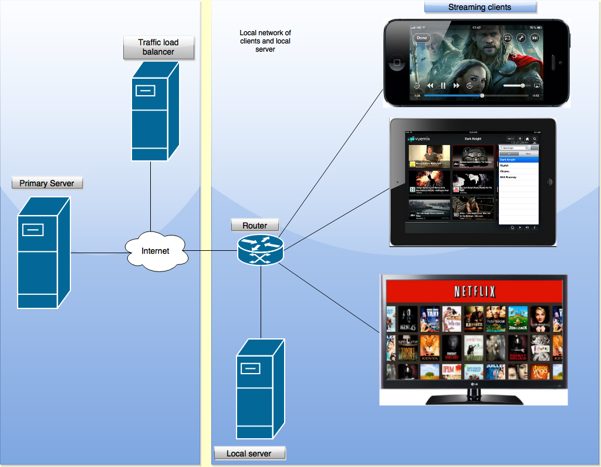
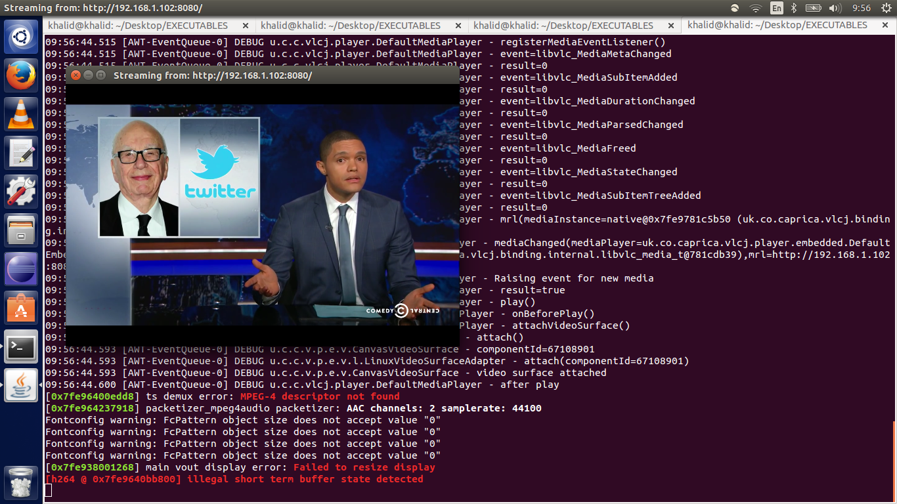
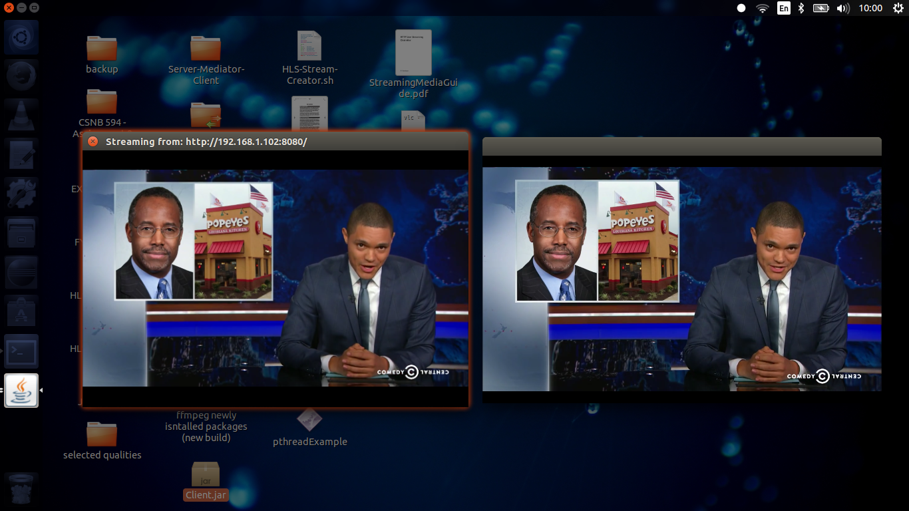
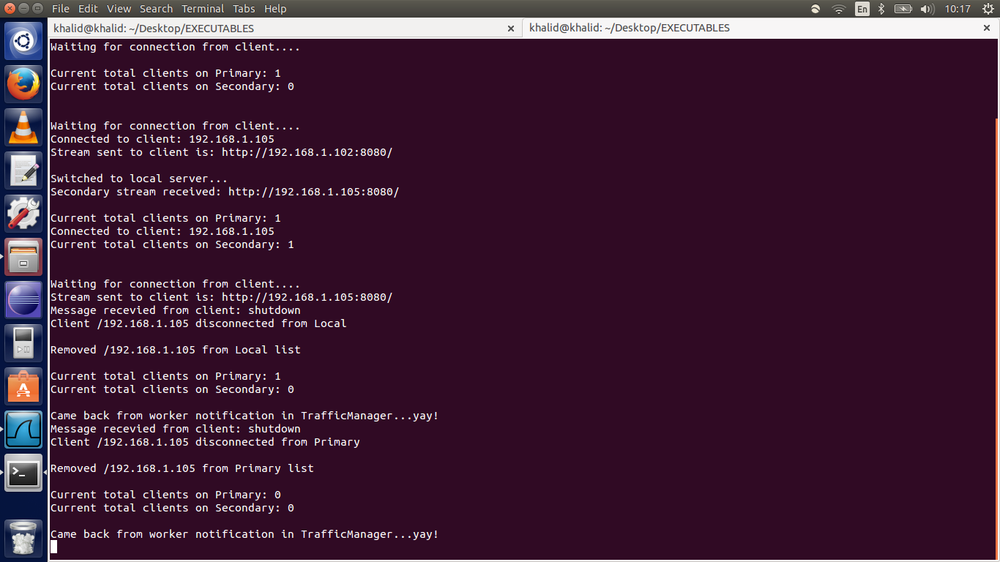

#Live Video Streaming Architecture 

This is the implementation of a live video streaming architecture. It is the prototype of a research that I have done on video streaming
distributed architectures. The novel idea in this research is a unique way of doing load balancing and a new way of using HTTP Live Streaming. 

This architecture addresses one thing mainly: the efficient usage of resources during high traffic peak periods. 
For example, if you are a video content provider how are you going to address the huge amount of traffic that will come from a specific region 
during the new president's inauguration?

The load balancing mechanim works by using a temporary secondary server. That server will only be used during high traffic period in
a specific region. Unlike other architectures, the secondary server is not a duplicate of the original server. Howerver, it streams from 
the original server and re-streams to its own base of clients, thus reducing load on the original server. 

The architecture also makes use of Apple's HLS protocol. However, instead of doing bitrate adaptation from the client side, we are doing 
bitrate adaption from the server side. What does this mean? This will allow the server to stream good quality video when the its bandwidth is high, 
and serve low quality video when the traffic increases and its bandwidth drops. 

#Implementation details
Operating System: Ubuntu 14.04  
Web server:  Apache2  
Programming Language: Java  
APIs Used: VLCJ API (http://capricasoftware.co.uk/#/projects/vlcj)
Video segmentation script: HLS-Stream-Creator by Ben Tasker (https://github.com/bentasker/HLS-Stream-Creator).  

#Execution order of the programs 
There are three programs in this project: PrimaryServer, TrafficManager, LocalServer and Client  
Run the primary server  
Run the Traffic Manager  
Run the local server  
Run the client  

Primary Server Usage
$ java -jar PrimaryServer.java ip_address m3u8_url
 
Traffic Manager Usage
$java -jar TrafficManager.java primary_server_stream_url threshold
 
Local Server Usage
$java -jar LocalServer.java local_ip traffic_manager_ip traffic_manager_port
 
Client usage
$java -jar Client.java traffic_manager_ip traffic_manager_port
#System Architecture
    
.png)  
#Screenshots
First client streaming from primary server 
  
Two clients - one streaming from primary server and the other from the secondary server
  
Traffic manager keeping track if threshold is reached by counting the clients in both servers

